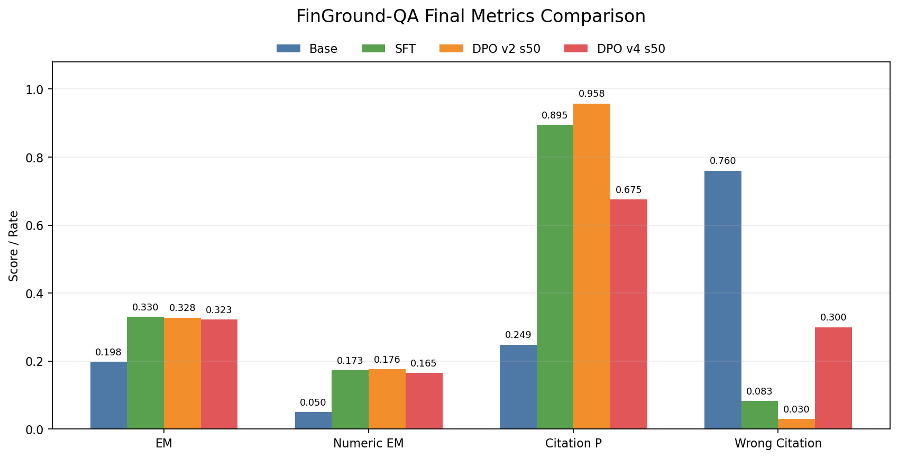

# FinGround-QA

FinGround-QA 是一个面向金融报告问答的 grounded generation 后训练项目。项目重点不是做完整金融大模型、RAG 检索系统或 PDF 解析系统，而是在“问题 + 证据上下文已经给定”的受控场景下，研究 SFT 和 DPO 如何影响：

```text
答案正确性
数值计算与尺度稳定性
引用可靠性
拒答 / 强答行为
偏好数据质量与 DPO 副作用
```

项目定位：

```text
FinGround-QA: Error-Type Balanced DPO for Financial Grounded Generation
```

## 方法链路

```text
TAT-QA / FinQA 数据标准化
-> 统一 question-context-evidence schema
-> 证据引用与泄漏检查
-> grounded JSON 格式 SFT 数据
-> Base Qwen2.5-7B-Instruct 评测
-> QLoRA SFT
-> SFT 输出挖掘 rejected answers
-> Error-Type Balanced DPO
-> 多版本 DPO checkpoint sweep
-> citation / numeric / answerability 细粒度评测
-> badcase audit 与模型选择
```

## 当前结论

主评测集为 400 条 held-out 样本。错误类指标越低越好，其余指标越高越好。

| model | exact_match | numeric_exact_match | faithfulness_rate | citation_precision | citation_consistency_score | wrong_citation_rate | fabricated_number_rate | calculation_error_rate |
| --- | ---: | ---: | ---: | ---: | ---: | ---: | ---: | ---: |
| Base | 0.1975 | 0.0504 | 0.1675 | 0.2487 | 0.2202 | 0.7600 | 0.6000 | 0.6300 |
| SFT | 0.3300 | 0.1727 | 0.4200 | 0.8950 | 0.6331 | 0.0825 | 0.5350 | 0.5750 |
| DPO v1 s500 | 0.2975 | 0.1475 | 0.4000 | 0.9450 | 0.6225 | 0.0125 | 0.5625 | 0.5925 |
| DPO v2 s50 | 0.3275 | 0.1763 | 0.4175 | 0.9575 | 0.6425 | 0.0300 | 0.5525 | 0.5725 |
| DPO v2 s100 | 0.3175 | 0.1691 | 0.4075 | 0.9525 | 0.6356 | 0.0350 | 0.5600 | 0.5775 |
| DPO v3 guarded s100 | 0.3275 | 0.1727 | 0.4125 | 0.9450 | 0.6369 | 0.0300 | 0.5500 | 0.5750 |
| DPO v4 targeted s50 | 0.3225 | 0.1655 | 0.3425 | 0.6750 | 0.5681 | 0.3000 | 0.5550 | 0.5800 |
| DPO v4 targeted s75 | 0.3175 | 0.1583 | 0.3375 | 0.6400 | 0.5600 | 0.3275 | 0.5550 | 0.5850 |
| DPO v4 targeted s100 | 0.3200 | 0.1655 | 0.3400 | 0.6275 | 0.5581 | 0.3400 | 0.5475 | 0.5800 |



当前模型选择：

```text
正式 baseline: SFT
最佳 DPO candidate: DPO v2 checkpoint-50
DPO v3: 不晋升，只作为 guarded DPO 消融
DPO v4: 不晋升，只作为 targeted DPO 负结果 / 消融
```

核心发现：

```text
SFT 将 Base EM 从 19.75% 提升到 33.00%，是最稳的正式 baseline。
DPO v2 s50 在 EM 接近 SFT 的同时，把 citation precision 提升到 95.75%，wrong-citation rate 降到 3.00%。
DPO 不是免费提升：v3/v4 实验表明，偏好数据设计不稳会带来数值尺度、引用可靠性和 answerability 副作用。
v4 targeted DPO 没有打过 v2，尤其 citation precision 从 v2 s50 的 95.75% 掉到 67.50%，wrong-citation rate 升到 30.00%。
```

## 数据与产物

```text
SFT train: 5000
SFT val: 500
Main eval: 400
FinanceBench audit: 150
Unified rows: 24283
Train/eval exact question overlap: 0
Evidence quote hit rate: 90.6%
```

关键文件：

```text
data/unified/train_unified.jsonl
data/unified/val_unified.jsonl
data/unified/eval_unified.jsonl
data/sft/sft_train.jsonl
data/sft/sft_val.jsonl
data/eval/eval.jsonl
data/dpo/rule_dpo_pairs.jsonl
data/dpo/dpo_targeted_v4.jsonl
results/*_metrics.json
reports/final_experiment_report_zh.md
reports/dpo_model_selection_report.md
reports/dpo_v3_posthoc_audit_report.md
reports/final_metrics_comparison.png
docs/project_showcase_zh.md
docs/resume_project_brief.md
docs/final_resume_bullets_zh.md
docs/interview_script.md
```

## 本地数据构建

```bash
python -m src.finground_qa.pipeline prepare-data --output-dir .
python -m src.finground_qa.pipeline validate-sft \
  --file data/sft/sft_train.jsonl \
  --output reports/validate_sft_train.json
python -m src.finground_qa.pipeline build-rule-dpo \
  --unified-train data/unified/train_unified.jsonl \
  --target 600 \
  --output data/dpo/rule_dpo_pairs.jsonl \
  --report reports/preference_pair_quality_report.json
python -m src.finground_qa.pipeline audit-pairs \
  --pairs data/dpo/rule_dpo_pairs.jsonl \
  --output results/preference_pair_audit_100.jsonl
python -m src.finground_qa.pipeline summarize-audit \
  --audit results/preference_pair_audit_100.jsonl \
  --output reports/preference_pair_audit_report.json
python -m src.finground_qa.pipeline build-answerability-eval
python -m src.finground_qa.pipeline data-difficulty-audit
```

## 主要指标

```text
exact_match
numeric_exact_match
faithfulness_rate
unsupported_claim_rate
citation_precision
citation_consistency_score
chunk_valid_rate
quote_hit_rate
number_coverage_rate
entity_or_token_coverage_rate
missing_evidence_rate
wrong_citation_rate
fabricated_number_rate
calculation_error_rate
over_refusal_rate
forced_answer_rate
generic_answer_rate
format_error_rate
schema_pass_rate
```

## 项目边界

范围内：

```text
金融报告 QA 后训练
grounded JSON answer protocol
证据引用检查
数值 grounding proxy
SFT / DPO / checkpoint selection
偏好对质量审计
badcase 与 error-delta 分析
```

范围外：

```text
金融投资建议
完整 RAG 检索系统
PDF/OCR 解析
生产级事实性判定器
GRPO / PPO / IPO
多基座模型横评
```

## 局限性

`faithfulness_rate`、`unsupported_claim_rate` 和 `citation_consistency_score` 是规则与弱语义 proxy，不等价于完整事实性评测。项目结论需要结合人工 badcase audit 解读，不能只看单一自动指标。

更完整的中文实验结论见：

```text
reports/final_experiment_report_zh.md
reports/dpo_model_selection_report.md
docs/project_status_20260429.md
docs/project_showcase_zh.md
docs/resume_project_brief.md
docs/final_resume_bullets_zh.md
docs/interview_script.md
```
